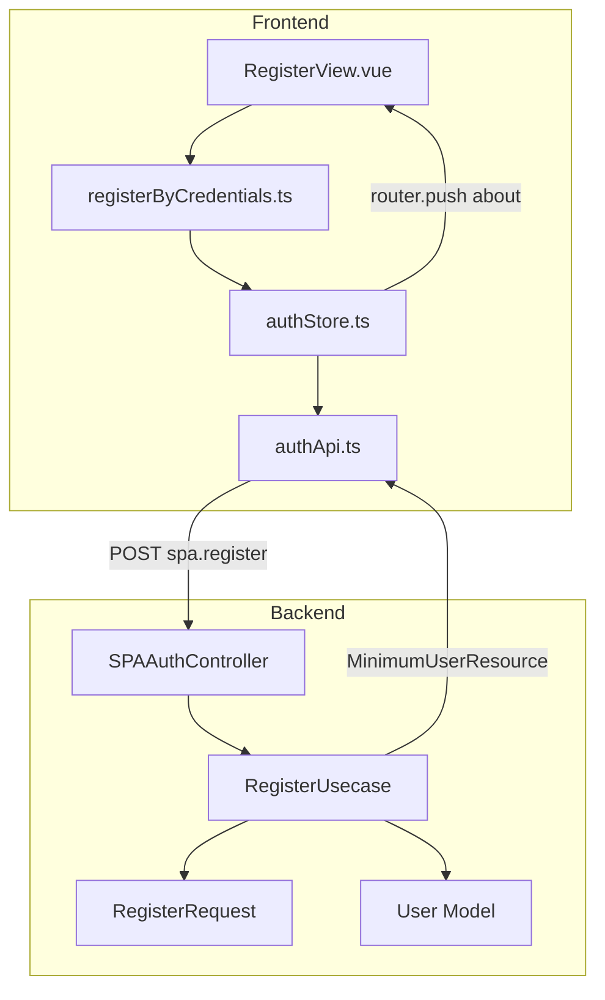
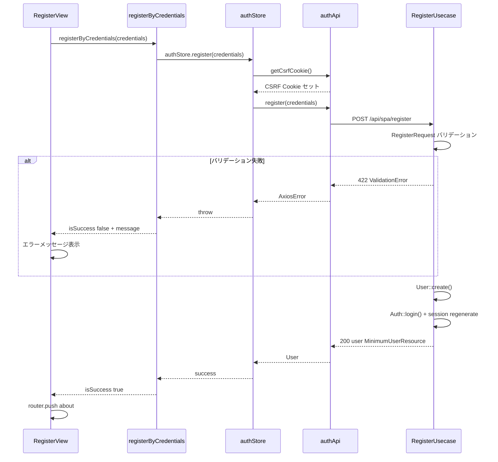

# Design Document: ユーザー新規登録機能

## Overview

本機能は、Laravel + Vue 3 SPA アプリケーションにユーザー新規登録を追加する。未登録ユーザーがユーザー名・メールアドレス・パスワードを入力してアカウントを作成し、登録完了後に自動ログイン状態で AboutView へ遷移するエンドツーエンドのフローを実現する。

**Purpose**: 未登録ユーザーに自己サービス登録手段を提供し、認証フローへの入口を確立する。
**Users**: 未登録の一般ユーザーが新規アカウント作成に使用する。
**Impact**: 既存の認証ドメイン（`SPAAuthController`, `authStore`, `authApi`）を最小限の変更で拡張し、既存の Login / Logout / GetCurrentUser フローと整合性を保つ。

### Goals

- ユーザー名・メールアドレス・パスワード・パスワード確認の4項目による新規ユーザー登録を実現する
- フロントエンドおよびバックエンドの両レイヤーで入力バリデーションを実施する
- 登録完了後に自動ログイン状態で AboutView へリダイレクトする
- 既存認証パターン（MVC + Usecase, FSD アーキテクチャ）に完全準拠する

### Non-Goals

- メールアドレス確認（Email Verification）機能
- ソーシャルログイン連携
- 管理者による承認フロー
- 登録フォームの多言語対応

---

## Architecture

### Existing Architecture Analysis

本機能は既存の認証ドメインへの拡張である（`research.md` の「既存認証パターンの分析」参照）。

- **既存コントローラ**: `SPAAuthController` は Login / Logout / GetCurrentUser を管理しており、`register` メソッドの追加は自然な拡張
- **既存フロントパターン**: `authStore` → `authApi` → `ziggyRoute` の呼び出しチェーン、`xxxByCredentials.ts` によるエラーハンドリング統合
- **既存フォーム**: `RegisterView.vue` はフォーム UI が実装済みで API 呼び出しとリダイレクトのみ未実装（TODO コメントあり）

### Architecture Pattern & Boundary Map



**Architecture Integration**:
- Selected pattern: 既存 MVC + Usecase パターンへの拡張
- Domain/feature boundaries: 認証ドメイン内で完結。`SPAAuthController` に `register` メソッドを追加し、専用 `RegisterUsecase` に処理を委譲
- Existing patterns preserved: FormRequest によるバリデーション、Usecase の `__invoke` パターン、`MinimumUserResource` レスポンス、`ziggyRoute` による API 呼び出し
- New components rationale: `RegisterUsecase`（登録ビジネスロジックの分離）、`RegisterRequest`（バリデーション定義）、`registerByCredentials.ts`（フロントエラーハンドリング統合）
- Steering compliance: MVC + Usecase パターン、FSD アーキテクチャ、OpenAPI スキーマ生成フローに準拠

### Technology Stack

| Layer | Choice / Version | Role in Feature | Notes |
|-------|------------------|-----------------|-------|
| Frontend | Vue 3 + TypeScript | RegisterView フォーム・状態管理 | Composition API |
| State Management | Pinia | authStore の register アクション | 既存ストアを拡張 |
| HTTP Client | Axios + ziggyRoute | POST /api/spa/register 呼び出し | 既存 apiClient を使用 |
| UI Components | PrimeVue | InputText, Password, Message, Button | 既存フォームと統一 |
| Backend | Laravel 12 + PHP 8.2 | RegisterRequest, RegisterUsecase | Usecase パターン |
| Auth | Laravel Sanctum | CSRF 保護、セッション管理 | getCsrfCookie() 再利用 |
| Database | MariaDB | users テーブルへの INSERT | User::create() |
| Type Safety | OpenAPI → schema.d.ts | RegisterCredentials 型自動生成 | mise generate:openapi |

---

## System Flows



---

## Requirements Traceability

| Requirement | Summary | Components | Interfaces | Flows |
|-------------|---------|------------|------------|-------|
| 1.1 | 登録フォームの表示（4フィールド） | RegisterView | — | — |
| 1.2 | 送信ボタンの表示 | RegisterView | — | — |
| 1.3 | 全フィールド必須 | RegisterView, RegisterRequest | RegisterRequest.rules() | — |
| 2.1 | 全必須フィールドのバリデーション | RegisterView | HTML required 属性 | — |
| 2.2〜2.8 | 各フィールドのエラーメッセージ表示 | RegisterView, registerByCredentials | Result.message | — |
| 3.1 | 登録 API エンドポイント提供 | SPAAuthController, api.php | POST /api/spa/register | SequenceDiagram |
| 3.2 | バックエンドバリデーション | RegisterRequest | rules() | SequenceDiagram |
| 3.3 | メール重複エラー | RegisterRequest | unique:users,email | SequenceDiagram |
| 3.4 | 422 レスポンス | RegisterUsecase | ValidationException | SequenceDiagram |
| 3.5 | パスワードハッシュ化・ユーザー保存 | RegisterUsecase | User::create() | SequenceDiagram |
| 3.6 | 認証セッション開始 | RegisterUsecase | Auth::login() | SequenceDiagram |
| 4.1 | 処理中のボタン無効化 | RegisterView, authStore | isLoading | — |
| 4.2 | ローディング表示 | RegisterView | MdiButton loading prop | — |
| 4.3 | 完了後のボタン再有効化 | authStore | isLoading finally | SequenceDiagram |
| 5.1 | 成功後 AboutView へリダイレクト | RegisterView | router.push about | SequenceDiagram |
| 5.2 | エラー時のフォーム維持とメッセージ表示 | RegisterView, registerByCredentials | errorMessage ref | SequenceDiagram |
| 6.1 | Ziggy ルート再生成 | api.php | mise generate:ziggy | — |
| 6.2 | OpenAPI スキーマ再生成 | RegisterRequest | mise generate:openapi | — |

---

## Components and Interfaces

### コンポーネント概要

| Component | Domain/Layer | Intent | Req Coverage | Key Dependencies | Contracts |
|-----------|--------------|--------|--------------|------------------|-----------|
| RegisterRequest | Backend/Request | 登録リクエストのバリデーション | 1.3, 3.2, 3.3, 3.4 | FormRequest (P0) | Service |
| RegisterUsecase | Backend/Usecase | ユーザー作成とセッション開始 | 3.5, 3.6 | RegisterRequest (P0), User (P0), Auth (P0) | Service |
| SPAAuthController | Backend/Controller | register リクエストの受付と委譲 | 3.1 | RegisterUsecase (P0) | API |
| api.php | Backend/Route | API ルート定義 | 3.1, 6.1 | SPAAuthController (P0) | — |
| authApi.ts | Frontend/Entities | register API 呼び出し関数 | 3.1 | ziggyRoute (P0), apiClient (P0) | Service |
| auth.ts | Frontend/Types | RegisterCredentials 型定義 | 3.2 | schema.d.ts (P0) | — |
| authStore.ts | Frontend/Entities | register アクションと isLoading 管理 | 3.6, 4.1, 4.3 | authApi (P0), getCsrfCookie (P0) | State |
| registerByCredentials.ts | Frontend/Entities | エラーハンドリング統合 | 2.2〜2.8, 5.2 | authStore (P0) | Service |
| RegisterView.vue | Frontend/Pages | 登録フォーム UI と送信処理 | 1.1, 1.2, 1.3, 2.1, 4.1, 4.2, 5.1 | registerByCredentials (P0), authStore (P0) | — |

---

### Backend / Request

#### RegisterRequest

| Field | Detail |
|-------|--------|
| Intent | 新規登録フォームのサーバーサイドバリデーションを定義する |
| Requirements | 1.3, 3.2, 3.3, 3.4 |

**Responsibilities & Constraints**
- name, email, password, password_confirmation の必須検証
- email の一意性検証（`unique:users,email`）
- password の最小文字数検証（min:8）
- password の確認一致検証（`confirmed` ルール）

**Dependencies**
- Inbound: SPAAuthController — リクエストの依存注入 (P0)
- External: Laravel FormRequest — バリデーション基盤 (P0)

**Contracts**: Service [x]

##### Service Interface

```php
class RegisterRequest extends FormRequest
{
    public function authorize(): bool;

    /** @return array<string, array<mixed>|string> */
    public function rules(): array;
    // name: required|string|max:255
    // email: required|string|email|max:255|unique:users,email
    // password: required|string|min:8|confirmed
    // password_confirmation: required|string
}
```

- Preconditions: HTTP リクエストボディに name, email, password, password_confirmation が含まれること
- Postconditions: バリデーション失敗時は 422 ValidationException を自動スロー
- Invariants: email は users テーブルで一意でなければならない

**Implementation Notes**
- Integration: SPAAuthController の `register` メソッドの引数に依存注入される
- Validation: Laravel の `confirmed` ルールは `password_confirmation` フィールドを自動認識する
- Risks: email 重複時のエラーメッセージは Laravel 標準の日本語化ファイルに依存

---

### Backend / Usecase

#### RegisterUsecase

| Field | Detail |
|-------|--------|
| Intent | ユーザーレコードを作成し、セッションを開始してユーザー情報を返す |
| Requirements | 3.5, 3.6 |

**Responsibilities & Constraints**
- バリデーション済みデータから User レコードを作成する
- `Auth::login()` と `session()->regenerate()` でセッションを確立する
- `MinimumUserResource` でレスポンスを整形する
- ビジネスロジックのみを実装し、HTTP バインディングは持たない

**Dependencies**
- Inbound: SPAAuthController — `__invoke` 呼び出し (P0)
- Outbound: User モデル — `User::create()` (P0)
- External: Laravel Auth ファサード — `Auth::login()` (P0)
- External: MinimumUserResource — レスポンス整形 (P0)

**Contracts**: Service [x]

##### Service Interface

```php
class RegisterUsecase
{
    public function __invoke(RegisterRequest $request): JsonResponse;
    // 成功時: 200 { user: { id: int, name: string } }
    // 失敗時: RegisterRequest バリデーションが自動で 422 をスロー
}
```

- Preconditions: RegisterRequest のバリデーションが通過済みであること
- Postconditions: users テーブルに新規レコードが作成され、セッションが開始されている
- Invariants: password は User モデルの hashed cast により自動ハッシュ化される

**Implementation Notes**
- Integration: `$user = User::create($request->only('name', 'email', 'password'))` → `Auth::login($user)` → `$request->session()->regenerate()`
- Validation: バリデーションは RegisterRequest に委譲するため、Usecase 内での追加検証は不要
- Risks: User::create() 失敗時（DB エラー等）は 500 として処理される

---

### Backend / Controller

#### SPAAuthController（拡張）

| Field | Detail |
|-------|--------|
| Intent | register リクエストを受け取り RegisterUsecase に委譲する |
| Requirements | 3.1 |

**Contracts**: API [x]

##### API Contract

| Method | Endpoint | Request | Response | Errors |
|--------|----------|---------|----------|--------|
| POST | /api/spa/register | RegisterRequest | `{ user: MinimumUserResource }` | 422, 500 |

**Implementation Notes**
- Integration: 既存の `login`, `logout`, `user` メソッドと同様のパターンで `register` メソッドを追加する

---

### Frontend / Entities

#### authApi.ts（拡張）

| Field | Detail |
|-------|--------|
| Intent | バックエンドの登録 API を呼び出す関数を追加する |
| Requirements | 3.1 |

**Contracts**: Service [x]

##### Service Interface

```typescript
export function register(credentials: RegisterCredentials): Promise<User>
// POST ziggyRoute('spa.register') へリクエスト
// 成功: response.data.user を返却
// 失敗: AxiosError をスロー（呼び出し側でハンドリング）
```

**Implementation Notes**
- Integration: `login()` 関数と同様のパターンで実装する

---

#### auth.ts（型定義拡張）

| Field | Detail |
|-------|--------|
| Intent | 登録フォームの入力データ型を定義する |
| Requirements | 3.2 |

**Contracts**: Service [x]

##### Service Interface

```typescript
// mise generate:openapi 実行後に schema.d.ts から取得
export type RegisterCredentials = components['schemas']['RegisterRequest']
// { name: string; email: string; password: string; password_confirmation: string }
```

**Implementation Notes**
- Integration: `LoginCredentials = components['schemas']['LoginRequest']` と同パターン
- Risks: バックエンド実装と `mise generate:openapi` の実行が必須の前提条件

---

#### authStore.ts（拡張）

| Field | Detail |
|-------|--------|
| Intent | 登録処理のアクションと isLoading 状態管理を追加する |
| Requirements | 3.6, 4.1, 4.3 |

**Contracts**: State [x]

##### State Management

```typescript
async function register(credentials: RegisterCredentials): Promise<void>
// isLoading = true
// getCsrfCookie() → apiRegister(credentials)
// 成功時: user.value に登録ユーザーを設定
// finally: isLoading = false
```

- State model: `user`, `isLoading` — 既存 state を再利用
- Persistence & consistency: `isLoading` は finally で必ず false に戻す（4.3 要件）
- Concurrency strategy: `isLoading` フラグによる単一リクエスト制御

**Implementation Notes**
- Integration: `login()` アクションと同様の実装パターン（getCsrfCookie → API 呼び出し）

---

#### registerByCredentials.ts（新規）

| Field | Detail |
|-------|--------|
| Intent | 登録処理のエラーハンドリングを統合し、ビュー層に Result 型を返す |
| Requirements | 2.2〜2.8, 5.2 |

**Contracts**: Service [x]

##### Service Interface

```typescript
interface Result {
  isSuccess: boolean
  message: string | null
}

export async function registerByCredentials(
  credentials: RegisterCredentials,
): Promise<Result>
```

- Preconditions: `credentials` に name, email, password, password_confirmation が含まれること
- Postconditions: `{ isSuccess: true, message: null }` または `{ isSuccess: false, message: エラーメッセージ }` を返す
- Invariants: 例外をスローせず、常に Result を返す

**HTTP エラーハンドリング**:
- 422: `errors` の全フィールドのエラーを改行結合してメッセージとして返す
- ネットワークエラー / その他: 汎用エラーメッセージを返す

**Implementation Notes**
- Integration: `loginByCredentials.ts` と同様のパターンで実装する
- Risks: 422 エラーの `errors` オブジェクトに複数フィールドが含まれる場合は `Object.values().flat().join('\n')` で結合

---

### Frontend / Pages

#### RegisterView.vue（拡張）

| Field | Detail |
|-------|--------|
| Intent | 登録フォームの送信処理を完成させ、結果に応じてリダイレクトまたはエラー表示を行う |
| Requirements | 1.1, 1.2, 1.3, 2.1, 4.1, 4.2, 5.1, 5.2 |

**Contracts**: — （UI コンポーネント、プレゼンテーション層）

**Implementation Notes**
- Integration: `registerByCredentials` を呼び出し、`isSuccess` が true の場合は `router.push({ name: 'about' })` へ遷移、false の場合は `errorMessage` に `result.message` を設定する
- Validation: パスワード一致チェックは既存実装を維持する（クライアントサイドの早期バリデーション）
- Risks: フォーム UI はすでに実装済みのため、変更は `handleRegister()` 関数内の TODO 部分のみ

---

## Data Models

### Domain Model

- **Aggregate**: `User`（ユーザー登録の集約ルート）
- **Entities**: `User`（id, name, email, password_hash, created_at, updated_at）
- **Value Objects**: email（一意性制約を持つ識別子として機能）
- **Business Rules**: email は users テーブルで一意、password は最小8文字、登録後は即座に認証済み状態

### Logical Data Model

**Structure Definition**:
- `users` テーブルへの INSERT（既存テーブル）
- 使用フィールド: `name` (string, max:255), `email` (string, unique), `password` (hashed string)
- Natural key: `email`

**Consistency & Integrity**:
- User::create() は単一トランザクション内で実行
- password は Eloquent cast（hashed）により自動ハッシュ化
- 既存テーブルへの追加のため、マイグレーション変更は不要

### Data Contracts & Integration

**API Data Transfer**

リクエスト:
```json
{
  "name": "string",
  "email": "string",
  "password": "string",
  "password_confirmation": "string"
}
```

レスポンス（成功）:
```json
{
  "user": {
    "id": "number",
    "name": "string"
  }
}
```

レスポンス（バリデーションエラー）:
```json
{
  "message": "string",
  "errors": {
    "name": ["string"],
    "email": ["string"],
    "password": ["string"]
  }
}
```

---

## Error Handling

### Error Strategy

バリデーションエラーはバックエンドの FormRequest が 422 を自動で返し、フロントの `registerByCredentials.ts` がメッセージとして集約する。ネットワークエラーや 500 は汎用メッセージで処理する。

### Error Categories and Responses

**User Errors (4xx)**:
- 422: バリデーション失敗（必須フィールド未入力、メール形式不正、パスワード短すぎ、パスワード不一致、メール重複）→ RegisterView の `errorMessage` にメッセージを表示

**System Errors (5xx)**:
- 500: DB エラーなど予期しないエラー → 汎用エラーメッセージを表示

**Business Logic Errors (422)**:
- メールアドレス重複: `The email has already been taken.` に相当するメッセージをフィールドエラーとして返す

### Monitoring

- バックエンドの例外は Laravel の標準ログ（`storage/logs/laravel.log`）に記録される
- フロントエンドのエラーは `errorMessage ref` で画面に表示（ユーザーに通知）

---

## Testing Strategy

### Unit Tests（PHPUnit）

- `RegisterRequest` のバリデーションルール（必須・形式・最小長・一意性・confirmed）
- `RegisterUsecase` のユーザー作成とセッション開始処理
- パスワードが平文で保存されていないことの確認

### Integration Tests（PHPUnit）

- POST /api/spa/register の正常系フロー（ユーザー作成・セッション開始・レスポンス）
- メールアドレス重複時の 422 レスポンス
- バリデーション失敗時のフィールド別エラーレスポンス
- 登録後に GET /api/spa/user が認証済みユーザーを返すこと

### Unit Tests（Vitest）

- `registerByCredentials` の Result 返却パターン（成功・422・ネットワークエラー）
- `authStore.register` の isLoading 状態遷移（開始時 true → finally で false）

### E2E Tests（省略可）

- 登録フォームへの入力 → 送信 → AboutView へのリダイレクト確認

---

## Security Considerations

- CSRF 保護: 登録前に `getCsrfCookie()` を呼び出し、Sanctum の CSRF トークンを取得する（既存フローと統一）
- パスワード保護: User モデルの `hashed` cast により、DB には bcrypt ハッシュのみ保存される
- レート制限: 必要に応じて `throttle` ミドルウェアの追加を検討する（ログインは `throttle:10,1` を設定済み）
- バリデーション: フロントとバックエンドの両レイヤーで実施し、多層防御を実現する
